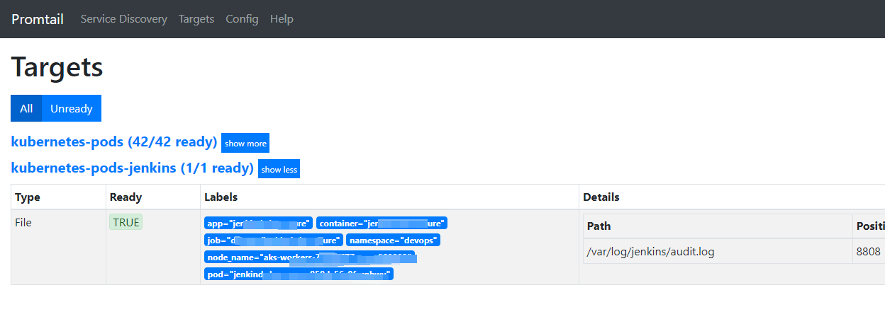

- OAMlab
- https://github.com/oamlab

# 关于部署Loki的概要资料(Overview of deploying Loki)

---

# Loki

## Loki 是什么
[loki](https://github.com/grafana/loki) 官方介绍：Loki 是一个 **可水平扩展**，**高可用**，**多租户** 的日志聚合收集系统，并且追求高性能和易于部署。对比一下它和别的日志收集系统：

- 由于它不创建全文索引，而且只存储压缩后的非结构化日志和元信息索引，所以很轻量级易于部署。
- 索引和分组与 Prometheus 使用相同的 label 。
- 非常适合收集 k8s pod 日志信息，类似 pod labels 这些元信息都是自动收集并添加索引的。
- 直接可以对接 Grafana 作为日志查询界面。

相对于 ELK 需要的资源更少，并且更易于部署。loki 组件也基本分为三个:

- **promtail** 日志收集 agent，收集日志并发送给 loki 。
- **loki** 核心服务，存储日志和索引，并提供查询服务。
- **Grafana** 日志查询界面。

架构图：
<p align="center">
	
</p>

<p align="center">
	
</p>

<p align="center">
	
</p>

## Loki 部署
根据k8s组件架构， **promtail** 需要运行在所有运行应用容器的节点，所以会是 **DaemonSet**，**loki** 作为核心服务，带有持久化存储而且支持横向扩展，所以应该是 **StatefulSet**，**Grafana** 是比较基本的独立应用，可以复用已部署的。最简单的方式还是使用 **helm**，loki 官方已经提供了生产可用的 chart 。
```
# 增加源并更新
$ helm repo add loki https://grafana.github.io/loki/charts
$ helm repo update
# 拉取 chart
$ helm fetch loki/loki-stack --untar --untardir .
$ cd loki-stack
# 将 values.yaml 中的 grafana.enable 改成 true，因为我们需要部署 grafana
# 生成 k8s 配置
$ helm template loki . > loki.yaml
# 部署
$ kubectl apply -f loki.yaml

注：
#持久化
主要修改loki的storageClass和persistence size
```

建议在本地生成出部署文件，手动部署，这样可以学习生成出来的配置文件，并且手动做某些更改时会更方便。

等待 pod 启动完成后我们就可以看到进入 grafana 查看了:
```
# 输出 grafana 登录密码
$ kubectl get secret --namespace default loki-grafana -o jsonpath="{.data.admin-password}" | base64 --decode ; echo
# port forward 让我们能够访问 grafana service
$ kubectl port-forward --namespace default service/loki-grafana 3000:80
```

接着打开 http://localhost:3000 进入 grafana 界面(用户名使用 admin)，点击 Explore 并且选择 label 就可以查看日志了。

<p align="center">
	
</p>


## 添加Loki看板
导入模板ID：13639
<p align="center">
	
</p>


**_注：现在k8s和loki已部署完成且能查看到k8s和业务pod日志_**


## Loki 利用k8s自动发现采集 Kubernetes Pod 内的其他日志
要在 Loki 中实现自动发现和自动采集 Kubernetes Pod 内的其他日志，可以利用 Kubernetes 的标签和注解机制。Promtail 可以通过配置自动发现新 Pod 并采集其日志。以下是详细步骤，帮助你配置 Promtail 以实现这个功能。

### 步骤 1: 配置 Promtail
修改 Promtail 的配置文件，使其能够自动发现并采集 Pod 内部的其他日志。

Promtail 配置示例
以下是一个示例 Promtail 配置文件 **promtail.yaml**，该配置会自动发现带有特定注解的 Pod，并采集其日志：
```
server:
  http_listen_port: 9080
  grpc_listen_port: 0

positions:
  filename: /tmp/positions.yaml

clients:
  - url: http://loki:3100/loki/api/v1/push

scrape_configs:
  - job_name: kubernetes-pods
    pipeline_stages:
      - docker: {}
    kubernetes_sd_configs:
      - role: pod
    relabel_configs:
      - source_labels: [__meta_kubernetes_namespace]
        target_label: namespace
      - source_labels: [__meta_kubernetes_pod_name]
        target_label: pod
      - source_labels: [__meta_kubernetes_pod_container_name]
        target_label: container
      - action: labelmap
        regex: __meta_kubernetes_pod_label_(.+)
      - source_labels: [__meta_kubernetes_pod_annotation_promtail_io_scrape]
        action: keep
        regex: true

- job_name: kubernetes-pods-jenkins
  pipeline_stages:
    - cri: {}
  kubernetes_sd_configs:
    - role: pod
  relabel_configs:
    - action: drop
      regex: ''
      source_labels:
      - __meta_kubernetes_pod_annotation_promtail_io_logfile     
    - source_labels:
        - __meta_kubernetes_pod_controller_name
      regex: ([0-9a-z-.]+?)(-[0-9a-f]{8,10})?
      action: replace
      target_label: __tmp_controller_name
    - source_labels:
        - __meta_kubernetes_pod_label_app_kubernetes_io_name
        - __meta_kubernetes_pod_label_app
        - __tmp_controller_name
        - __meta_kubernetes_pod_name
      regex: ^;*([^;]+)(;.*)?$
      action: replace
      target_label: app
    - source_labels:
        - __meta_kubernetes_pod_label_app_kubernetes_io_instance
        - __meta_kubernetes_pod_label_instance
      regex: ^;*([^;]+)(;.*)?$
      action: replace
      target_label: instance
    - source_labels:
        - __meta_kubernetes_pod_label_app_kubernetes_io_component
        - __meta_kubernetes_pod_label_component
      regex: ^;*([^;]+)(;.*)?$
      action: replace
      target_label: component
    - action: replace
      source_labels:
      - __meta_kubernetes_pod_node_name
      target_label: node_name
    - action: replace
      source_labels:
      - __meta_kubernetes_namespace
      target_label: namespace
    - action: replace
      replacement: $1
      separator: /
      source_labels:
      - namespace
      - app
      target_label: job
    - action: replace
      source_labels:
      - __meta_kubernetes_pod_name
      target_label: pod
    - action: replace
      source_labels:
      - __meta_kubernetes_pod_container_name
      target_label: container
    - action: replace
      regex: (.+)
      source_labels:
      - __meta_kubernetes_pod_annotation_promtail_io_logfile
      target_label: __path__
```

在这个配置中：

- **kubernetes-pods** 任务用于采集 Pod 标准输出的日志。
- **kubernetes-pods-jenkins** 任务用于采集带有特定注解的 Pod 内部的其他日志文件。

### 步骤 2: 配置 Pod 注解
在你的 Pod YAML 文件中添加注解，以指示 Promtail 采集特定日志文件。例如，假设你想采集 **/app/logs/custom.log** 文件：
```
apiVersion: v1
kind: Pod
metadata:
  name: my-app
  annotations:
    promtail.io/scrape: "true"
    promtail.io/log_path: "/app/logs/custom.log"
spec:
  containers:
    - name: my-app-container
      image: my-app-image
      volumeMounts:
        - name: app-logs
          mountPath: /app/logs
  volumes:
    - name: app-logs
      emptyDir: {}
```

### 步骤 3: 部署 Promtail 和 Pod

1. **创建并生成Promtail ConfigMap**：
```
kubectl create secret generic loki-promtail --from-file=promtail.yaml -n loki --dry-run=client -o yaml > loki-promtail.yaml
kubectl apply -f loki-promtail.yaml
```

2. **修改 Promtail Daemonset**：
````
kubectl -n loki edit daemonsets/loki-promtail
````

```
- mountPath: /var/log/jenkins
    name: jenkinslog
    readOnly: true
- hostPath:
    path: /var/log/jenkins
    type: ""
  name: jenkinslog
```

保存后 promtail pod 会自动重启

### 步骤 4: 验证和调试
````
kubectl -n loki port-forward --address 0.0.0.0 loki-promtail-z89ft 3101:3101
````
[http://127.0.0.1:3101/targets](http://127.0.0.1:3101/targets)

<p align="center">
	
</p>

通过上述配置，Promtail 可以自动发现并采集 Kubernetes Pod 内部的其他日志文件。只需在 Pod 注解中指定日志文件路径，Promtail 就会根据这些注解自动进行日志采集。这样可以简化日志管理流程，提高日志采集的灵活性和自动化程度。

## Loki 静态配置static config  收集日志
该代码适用于在虚拟机或物理机上直接追踪没有容器或容器环境的日志。

挂载了 volume 之后目的很明确，其实就是要收集 **/var/log/jenkins** 下面的日志文件，我们简单增加一条静态配置：
```
- job_name: custom
  pipeline_stages:
  static_configs:
  - labels:
      job: custom
      host: localhost
      __path__: /var/log/jenkins/audit.log
```